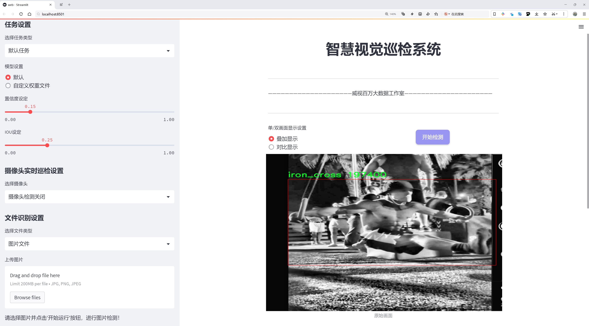
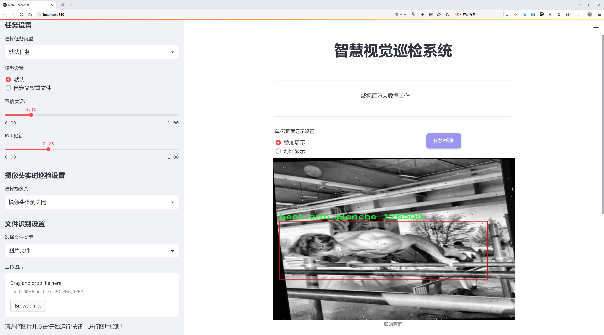
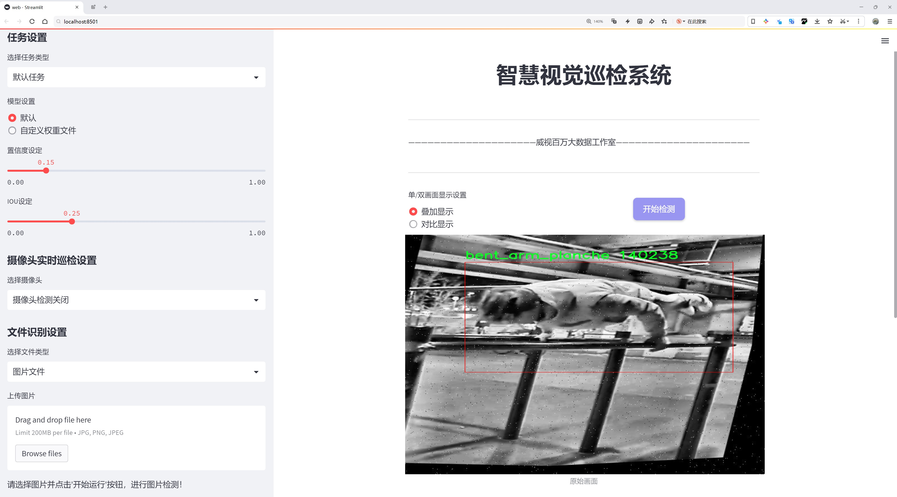
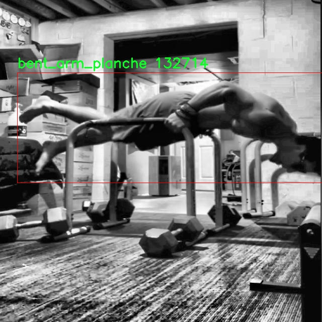
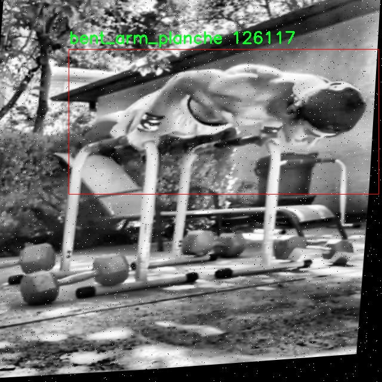
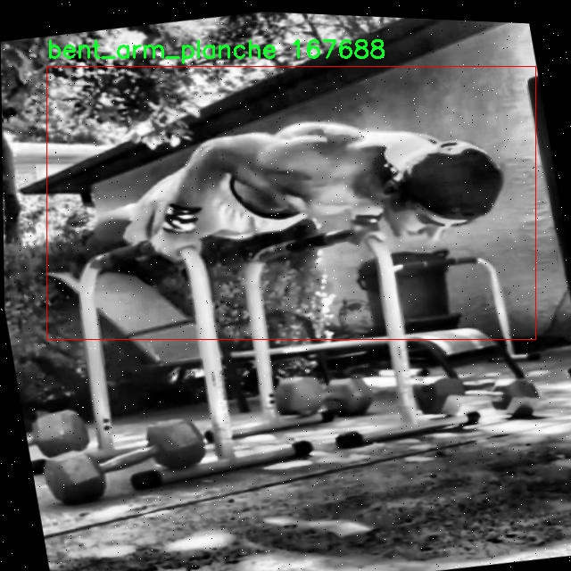
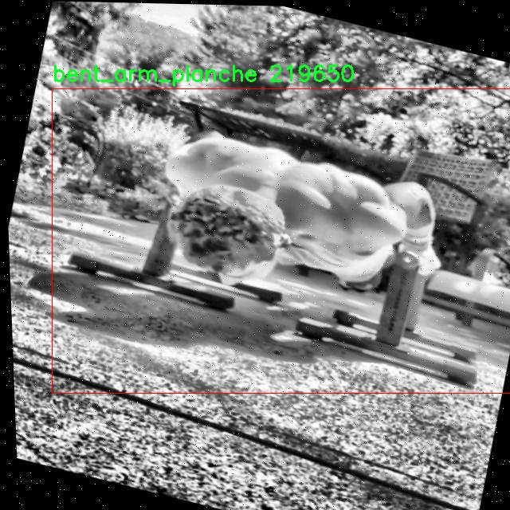
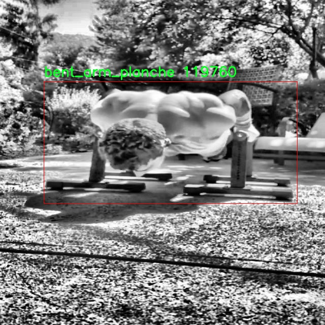
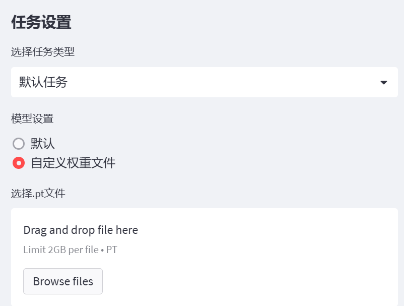

# 体操动作识别系统源码分享
 # [一条龙教学YOLOV8标注好的数据集一键训练_70+全套改进创新点发刊_Web前端展示]

### 1.研究背景与意义

项目参考[AAAI Association for the Advancement of Artificial Intelligence](https://gitee.com/qunmasj/projects)

项目来源[AACV Association for the Advancement of Computer Vision](https://kdocs.cn/l/cszuIiCKVNis)

研究背景与意义

随着科技的不断进步，计算机视觉技术在各个领域的应用日益广泛，尤其是在体育领域，运动动作的识别与分析已成为提升运动员训练效果和比赛表现的重要手段。体操作为一项对运动员身体素质和技术要求极高的运动，其动作的复杂性和多样性使得传统的动作识别方法面临诸多挑战。近年来，深度学习技术的快速发展为体操动作识别提供了新的解决方案，其中YOLO（You Only Look Once）系列模型因其高效的实时检测能力而受到广泛关注。YOLOv8作为该系列的最新版本，具备更强的特征提取能力和更快的推理速度，适合用于复杂动作的实时识别。

本研究旨在基于改进的YOLOv8模型，构建一个高效的体操动作识别系统，以提升体操训练的智能化水平。为实现这一目标，我们使用了CaliAI_v1.0.0数据集，该数据集包含1100张图像，涵盖了8种体操动作类别，包括弯臂平衡（bent_arm_planche）、前引体向上（front_lever）、前引体触碰（front_lever_touch）、倒立十字（inverted_cross）、铁十字（iron_cross）、马耳他（maltese）、平衡（planche）和环马耳他（rings_maltese）。这些动作不仅具有代表性，而且在体操比赛中频繁出现，能够为模型的训练和评估提供丰富的样本。

体操动作的复杂性体现在其多样的姿态和变化的动态特征上，传统的基于规则的方法难以有效捕捉这些细微的动作差异。通过采用YOLOv8模型，我们能够利用其深度学习的优势，自动提取图像中的特征，从而实现对不同体操动作的准确识别。此外，改进的YOLOv8模型在处理多类别检测时表现出色，能够在保证识别精度的同时，提高处理速度，满足实时应用的需求。

本研究的意义不仅在于技术层面的创新，更在于推动体操训练的智能化和科学化。通过构建高效的体操动作识别系统，教练员和运动员可以实时获取动作分析反馈，从而及时调整训练策略，优化动作技巧，减少受伤风险。此外，该系统还可以为体操比赛的裁判提供辅助判定，提升比赛的公正性和准确性。

综上所述，基于改进YOLOv8的体操动作识别系统的研究，不仅具有重要的学术价值，也对实际应用具有深远的影响。通过本研究，我们希望能够为体操运动的智能化发展贡献一份力量，同时为相关领域的研究提供新的思路和方法。

### 2.图片演示







##### 注意：由于此博客编辑较早，上面“2.图片演示”和“3.视频演示”展示的系统图片或者视频可能为老版本，新版本在老版本的基础上升级如下：（实际效果以升级的新版本为准）

  （1）适配了YOLOV8的“目标检测”模型和“实例分割”模型，通过加载相应的权重（.pt）文件即可自适应加载模型。

  （2）支持“图片识别”、“视频识别”、“摄像头实时识别”三种识别模式。

  （3）支持“图片识别”、“视频识别”、“摄像头实时识别”三种识别结果保存导出，解决手动导出（容易卡顿出现爆内存）存在的问题，识别完自动保存结果并导出到tempDir中。

  （4）支持Web前端系统中的标题、背景图等自定义修改，后面提供修改教程。

  另外本项目提供训练的数据集和训练教程,暂不提供权重文件（best.pt）,需要您按照教程进行训练后实现图片演示和Web前端界面演示的效果。

### 3.视频演示

[3.1 视频演示](https://www.bilibili.com/video/BV1Kk2nYZEpH/)

### 4.数据集信息展示

##### 4.1 本项目数据集详细数据（类别数＆类别名）

nc: 8
names: ['bent_arm_planche', 'front_lever', 'front_lever_touch', 'inverted_cross', 'iron_cross', 'maltese', 'planche', 'rings_maltese']


##### 4.2 本项目数据集信息介绍

数据集信息展示

在现代体育科学与人工智能的交叉领域，体操动作识别系统的开发与应用正逐渐成为研究的热点。为此，我们构建了一个名为“CaliAI_v1.0.0”的数据集，旨在为改进YOLOv8模型在体操动作识别方面的性能提供支持。该数据集包含了8个不同的体操动作类别，涵盖了从基础到高级的多种体操姿势，具有广泛的应用潜力和研究价值。

“CaliAI_v1.0.0”数据集的类别数量为8，具体类别包括：弯臂平衡（bent_arm_planche）、前杠（front_lever）、前杠触碰（front_lever_touch）、倒立十字（inverted_cross）、铁十字（iron_cross）、马耳他式（maltese）、平衡（planche）以及环马耳他式（rings_maltese）。这些类别不仅代表了体操运动中的不同技术动作，还体现了运动员在训练和比赛中所需的不同技能水平。每个类别的动作都具有独特的身体姿态和运动轨迹，这为动作识别系统的训练提供了丰富的样本。

在数据集的构建过程中，我们注重数据的多样性和真实性。每个类别的样本均来源于专业体操运动员的实际表演，确保了数据的高质量和可靠性。此外，为了增强模型的泛化能力，我们还在不同的环境条件下采集了数据，包括不同的光照、背景和摄像角度。这种多样化的数据采集方式使得“CaliAI_v1.0.0”数据集在体操动作识别的研究中具有较强的适应性和实用性。

数据集中的每个动作类别都配有详细的标注信息，包括动作的起始和结束帧、关键点位置以及运动员的身体姿态。这些标注信息为YOLOv8模型的训练提供了必要的监督信号，使得模型能够在学习过程中准确识别和分类不同的体操动作。同时，我们还对数据集进行了预处理，包括图像的归一化、数据增强等，以提高模型的训练效率和识别准确率。

“CaliAI_v1.0.0”数据集的推出，不仅为体操动作识别领域的研究提供了宝贵的资源，也为相关技术的应用奠定了基础。通过对该数据集的深入研究，我们期望能够推动体操动作识别技术的发展，为教练员和运动员提供更加科学的训练指导和反馈。同时，该数据集的应用也将为智能体育设备的研发提供数据支持，助力体操运动的智能化和数字化转型。

总之，“CaliAI_v1.0.0”数据集以其丰富的类别、真实的样本和详尽的标注，为改进YOLOv8的体操动作识别系统提供了坚实的基础。随着研究的深入和技术的不断进步，我们相信这一数据集将在体操动作识别领域发挥重要作用，推动相关研究的不断发展与创新。











### 5.全套项目环境部署视频教程（零基础手把手教学）

[5.1 环境部署教程链接（零基础手把手教学）](https://www.ixigua.com/7404473917358506534?logTag=c807d0cbc21c0ef59de5)


[5.2 安装Python虚拟环境创建和依赖库安装视频教程链接（零基础手把手教学）](https://www.ixigua.com/7404474678003106304?logTag=1f1041108cd1f708b01a)

### 6.手把手YOLOV8训练视频教程（零基础小白有手就能学会）

[6.1 手把手YOLOV8训练视频教程（零基础小白有手就能学会）](https://www.ixigua.com/7404477157818401292?logTag=d31a2dfd1983c9668658)


按照上面的训练视频教程链接加载项目提供的数据集，运行train.py即可开始训练



     Epoch   gpu_mem       box       obj       cls    labels  img_size
     1/200     20.8G   0.01576   0.01955  0.007536        22      1280: 100%|██████████| 849/849 [14:42<00:00,  1.04s/it]
               Class     Images     Labels          P          R     mAP@.5 mAP@.5:.95: 100%|██████████| 213/213 [01:14<00:00,  2.87it/s]
                 all       3395      17314      0.994      0.957      0.0957      0.0843

     Epoch   gpu_mem       box       obj       cls    labels  img_size
     2/200     20.8G   0.01578   0.01923  0.007006        22      1280: 100%|██████████| 849/849 [14:44<00:00,  1.04s/it]
               Class     Images     Labels          P          R     mAP@.5 mAP@.5:.95: 100%|██████████| 213/213 [01:12<00:00,  2.95it/s]
                 all       3395      17314      0.996      0.956      0.0957      0.0845

     Epoch   gpu_mem       box       obj       cls    labels  img_size
     3/200     20.8G   0.01561    0.0191  0.006895        27      1280: 100%|██████████| 849/849 [10:56<00:00,  1.29it/s]
               Class     Images     Labels          P          R     mAP@.5 mAP@.5:.95: 100%|███████   | 187/213 [00:52<00:00,  4.04it/s]
                 all       3395      17314      0.996      0.957      0.0957      0.0845


### 7.70+种全套YOLOV8创新点代码加载调参视频教程（一键加载写好的改进模型的配置文件）

[7.1 70+种全套YOLOV8创新点代码加载调参视频教程（一键加载写好的改进模型的配置文件）](https://www.ixigua.com/7404478314661806627?logTag=29066f8288e3f4eea3a4)

### 8.70+种全套YOLOV8创新点原理讲解（非科班也可以轻松写刊发刊，V10版本正在科研待更新）

#### 由于篇幅限制，每个创新点的具体原理讲解就不一一展开，具体见下列网址中的创新点对应子项目的技术原理博客网址【Blog】：


[8.1 70+种全套YOLOV8创新点原理讲解链接](https://gitee.com/qunmasj/good)

#### 部分改进原理讲解(完整的改进原理见上图和技术博客链接)

### YOLOv8简介
YOLOv8是一种目标检测模型，是基于YOLO (You Only Look Once)系列算法发展而来的最新版本。它的核心思想是将目标检测任务转化为一个回归问题，通过单次前向传播即可直接预测出图像中的多个目标的位置和类别。
YOLOv8的网络结构采用了Darknet作为其主干网络，主要由卷积层和池化层构成。与之前的版本相比，YOLOv8在网络结构上进行了改进，引入了更多的卷积层和残差模块，以提高模型的准确性和鲁棒性。
YOLOv8采用了一种特征金字塔网络(Feature Pyramid Network,FPN)的结构，通过在不同层级上融合多尺度的特征信息，可以对不同尺度的目标进行有效的检测。此外，YOLOv8还引入了一种自适应感知域(Adaptive Anchors
的机制，通过自适应地学习目标的尺度和
长宽比，提高了模型对于不同尺度和形状目标的检测效果。
总体来说，YOLOv8结构模型综合了多个先进的目标检测技术，在保证检测速度的同时提升了检测精度和鲁棒性，被广泛应用于实时目标检测任务中。


#### yolov8网络模型结构图

YOLOv8 (You Only Look Once version 8)是一种目标检测算法，它在实时场景下可以快速准确地检测图像中的目标。
YOLOv8的网络模型结构基于Darknet框架，由一系列卷积层、池化层和全连接层组成。主要包含以下几个组件:
1.输入层:接收输入图像。
2.卷积层:使用不同尺寸的卷积核来提取图像特征。
3.残差块(Residual blocks):通过使用跳跃连接(skip connections）来解决梯度消失问题，使得网络更容易训练。
4.上采样层(Upsample layers):通过插值操作将特征图的尺寸放大，以便在不同尺度上进行目标检测。
5.池化层:用于减小特征图的尺寸，同时保留重要的特征。
6.1x1卷积层:用于降低通道数，减少网络参数量。
7.3x3卷积层:用于进—步提取和组合特征。
8.全连接层:用于最后的目标分类和定位。
YOLOv8的网络结构采用了多个不同尺度的特征图来检测不同大小的目标，从而提高了目标检测的准确性和多尺度性能。
请注意，YOLOv8网络模型结构图的具体细节可能因YOLO版本和实现方式而有所不同。


#### yolov8模型结构
YOLOv8模型是一种目标检测模型，其结构是基于YOLOv3模型进行改进的。模型结构可以分为主干网络和检测头两个部分。
主干网络是一种由Darknet-53构成的卷积神经网络。Darknet-53是一个经过多层卷积和残差连接构建起来的深度神经网络。它能够提取图像的特征信息，并将这些信息传递给检测头。
检测头是YOLOv8的关键部分，它负责在图像中定位和识别目标。检测头由一系列卷积层和全连接层组成。在每个检测头中，会生成一组锚框，并针对每个锚框预测目标的类别和位置信息。
YOLOv8模型使用了预训练的权重，其中在COCO数据集上进行了训练。这意味着该模型已经通过大规模数据集的学习，具有一定的目标检测能力。

### RT-DETR骨干网络HGNetv2简介
#### RT-DETR横空出世
前几天被百度的RT-DETR刷屏，参考该博客提出的目标检测新范式对原始DETR的网络结构进行了调整和优化，以提高计算速度和减小模型大小。这包括使用更轻量级的基础网络和调整Transformer结构。并且，摒弃了nms处理的detr结构与传统的物体检测方法相比，不仅训练是端到端的，检测也能端到端，这意味着整个网络在训练过程中一起进行优化，推理过程不需要昂贵的后处理代价，这有助于提高模型的泛化能力和性能。


当然，人们对RT-DETR之所以产生浓厚的兴趣，我觉得大概率还是对YOLO系列审美疲劳了，就算是出到了YOLO10086，我还是只想用YOLOv5和YOLOv7的框架来魔改做业务。。

#### 初识HGNet
看到RT-DETR的性能指标，发现指标最好的两个模型backbone都是用的HGNetv2，毫无疑问，和当时的picodet一样，骨干都是使用百度自家的网络。初识HGNet的时候，当时是参加了第四届百度网盘图像处理大赛，文档图像方向识别专题赛道，简单来说，就是使用分类网络对一些文档截图或者图片进行方向角度分类。


当时的方案并没有那么快定型，通常是打榜过程发现哪个网络性能好就使用哪个网络做魔改，而且木有显卡，只能蹭Ai Studio的平台，不过v100一天8小时的实验时间有点短，这也注定了大模型用不了。 

流水的模型，铁打的炼丹人，最后发现HGNet-tiny各方面指标都很符合我们的预期，后面就一直围绕它魔改。当然，比赛打榜是目的，学习才是享受过程，当时看到效果还可以，便开始折腾起了HGNet的网络架构，我们可以看到，PP-HGNet 针对 GPU 设备，对目前 GPU 友好的网络做了分析和归纳，尽可能多的使用 3x3 标准卷积（计算密度最高），PP-HGNet是由多个HG-Block组成，细节如下：


ConvBNAct是啥？简单聊一聊，就是Conv+BN+Act，CV Man应该最熟悉不过了：
```python
class ConvBNAct(TheseusLayer):
    def __init__(self,
                 in_channels,
                 out_channels,
                 kernel_size,
                 stride,
                 groups=1,
                 use_act=True):
        super().__init__()
        self.use_act = use_act
        self.conv = Conv2D(
            in_channels,
            out_channels,
            kernel_size,
            stride,
            padding=(kernel_size - 1) // 2,
            groups=groups,
            bias_attr=False)
        self.bn = BatchNorm2D(
            out_channels,
            weight_attr=ParamAttr(regularizer=L2Decay(0.0)),
            bias_attr=ParamAttr(regularizer=L2Decay(0.0)))
        if self.use_act:
            self.act = ReLU()
 
    def forward(self, x):
        x = self.conv(x)
        x = self.bn(x)
        if self.use_act:
            x = self.act(x)
        return x 
```
且标准卷积的数量随层数深度增加而增多，从而得到一个有利于 GPU 推理的骨干网络，同样速度下，精度也超越其他 CNN ，性价比也优于ViT-base模型。


另外，我们可以看到：

PP-HGNet 的第一层由channel为96的Stem模块构成，目的是为了减少参数量和计算量。PP-HGNet

Tiny的整体结构由四个HG Stage构成，而每个HG Stage主要由包含大量标准卷积的HG Block构成。

PP-HGNet的第三到第五层使用了使用了可学习的下采样层（LDS Layer），该层group为输入通道数，可达到降参降计算量的作用，且Tiny模型仅包含三个LDS Layer，并不会对GPU的利用率造成较大影响.

PP-HGNet的激活函数为Relu，常数级操作可保证该模型在硬件上的推理速度。

### 9.系统功能展示（检测对象为举例，实际内容以本项目数据集为准）

图9.1.系统支持检测结果表格显示

  图9.2.系统支持置信度和IOU阈值手动调节

  图9.3.系统支持自定义加载权重文件best.pt(需要你通过步骤5中训练获得)

  图9.4.系统支持摄像头实时识别

  图9.5.系统支持图片识别

  图9.6.系统支持视频识别

  图9.7.系统支持识别结果文件自动保存

  图9.8.系统支持Excel导出检测结果数据





### 10.原始YOLOV8算法原理

原始YOLOv8算法原理

YOLOv8是由Ultralytics公司于2023年推出的最新目标检测算法，标志着YOLO系列的又一次重大进步。作为YOLOv5和YOLOv7的继承者，YOLOv8不仅在性能上进行了优化，还在结构设计上引入了多项创新。该算法的核心在于其高效的网络架构，主要由输入层、主干网络、颈部网络和头部网络构成，能够在多种应用场景中实现实时目标检测。

在YOLOv8中，输入图像首先被缩放至特定的尺寸，以满足模型的输入要求。主干网络采用了CSP（Cross Stage Partial）结构，通过卷积操作对图像进行下采样，从而提取出有用的特征。与YOLOv5不同的是，YOLOv8使用了C2f模块替代了YOLOv5中的C3模块。C2f模块的设计灵感来源于YOLOv7的E-ELAN结构，采用了跨层分支连接的方式，增强了模型的梯度流动，改善了特征提取的效果。具体而言，C2f模块由多个CBS（Convolution + Batch Normalization + SiLU）模块和多个Bottleneck网络组成，能够有效地缓解深层网络中的梯度消失问题，提升特征的重用率。

在主干网络的末尾，YOLOv8引入了SPPF（Spatial Pyramid Pooling Fast）模块，通过三个最大池化层对多尺度特征进行处理，进一步增强了网络的特征抽象能力。这一设计使得YOLOv8能够在处理不同尺寸的目标时，保持较高的检测精度。

颈部网络采用了PAN-FPN（Path Aggregation Network - Feature Pyramid Network）结构，这一结构的优势在于能够有效地融合不同尺度的特征图信息。通过自下而上的融合过程，YOLOv8能够将高层特征与中层和浅层特征进行深度整合，从而提高目标检测的准确性。具体来说，PAN-FPN结构在上采样阶段直接将高层特征与中层特征进行连接，确保了细节信息与语义信息的充分融合。

YOLOv8的检测网络采用了Anchor-Free的检测方式，显著简化了目标检测的过程。通过解耦头结构，YOLOv8能够将分类和回归任务分开处理，分别计算目标的类别和边框回归。这一设计不仅提高了模型的灵活性，还在一定程度上降低了计算复杂度。此外，YOLOv8使用了新的损失函数VFLLoss和DFLLoss+CIoULoss，旨在优化模型的训练过程，提升检测性能。

在样本匹配方面，YOLOv8引入了Task-Aligned的Assigner匹配方式，取代了以往的静态匹配策略。这一改进使得模型在训练过程中能够更好地适应不同的任务需求，提高了检测的鲁棒性。

数据预处理环节，YOLOv8依然沿用了YOLOv5的策略，采用了多种数据增强手段，如马赛克增强、混合增强、空间扰动和颜色扰动等。这些增强手段的引入，不仅丰富了训练数据的多样性，还有效提高了模型的泛化能力。

在YOLOv8的具体实现中，C2f模块的设计尤为关键。该模块通过将特征图分为两个分支，分别进行处理，增强了特征提取的灵活性和丰富性。第一个分支直接将特征图送入Concat层，而第二个分支则通过多个Bottleneck网络进行处理，最终将两个分支的特征进行叠加。这一设计使得C2f模块能够在保持输入输出特征图尺寸一致的前提下，提取出更多的隐藏特征。

YOLOv8的头部网络则负责将颈部网络输出的特征图转换为最终的检测结果。通过解耦的分类和回归分支，YOLOv8能够有效地处理不同尺度的特征图，输出目标的类别和边框信息。具体而言，YOLOv8的头部网络输出三个特征图，分别对应于80x80、40x40和20x20的尺度。这些特征图经过处理后，能够生成目标的边框预测和类别预测，确保了模型在不同场景下的适应性。

总的来说，YOLOv8在目标检测领域的创新和改进，使其在速度和精度上都达到了新的高度。通过引入C2f模块、PAN-FPN结构以及Anchor-Free的检测方式，YOLOv8不仅提高了检测的准确性，还显著提升了模型的计算效率。这些改进使得YOLOv8在实际应用中表现出色，能够满足日益增长的目标检测需求。随着YOLOv8的不断发展和完善，未来的目标检测技术将会更加智能和高效。


### 11.项目核心源码讲解（再也不用担心看不懂代码逻辑）

#### 11.1 70+种YOLOv8算法改进源码大全和调试加载训练教程（非必要）\ultralytics\nn\backbone\convnextv2.py

以下是经过简化和注释的核心代码部分，保留了主要的结构和功能。

```python
import torch
import torch.nn as nn
import torch.nn.functional as F
from timm.models.layers import trunc_normal_, DropPath

class LayerNorm(nn.Module):
    """ 自定义的LayerNorm层，支持两种数据格式：channels_last和channels_first。 """
    def __init__(self, normalized_shape, eps=1e-6, data_format="channels_last"):
        super().__init__()
        self.weight = nn.Parameter(torch.ones(normalized_shape))  # 权重参数
        self.bias = nn.Parameter(torch.zeros(normalized_shape))    # 偏置参数
        self.eps = eps
        self.data_format = data_format
        if self.data_format not in ["channels_last", "channels_first"]:
            raise NotImplementedError 
        self.normalized_shape = (normalized_shape, )
    
    def forward(self, x):
        # 根据数据格式进行归一化
        if self.data_format == "channels_last":
            return F.layer_norm(x, self.normalized_shape, self.weight, self.bias, self.eps)
        elif self.data_format == "channels_first":
            u = x.mean(1, keepdim=True)
            s = (x - u).pow(2).mean(1, keepdim=True)
            x = (x - u) / torch.sqrt(s + self.eps)
            x = self.weight[:, None, None] * x + self.bias[:, None, None]
            return x

class Block(nn.Module):
    """ ConvNeXtV2的基本块，包含深度可分离卷积和前馈网络。 """
    def __init__(self, dim, drop_path=0.):
        super().__init__()
        self.dwconv = nn.Conv2d(dim, dim, kernel_size=7, padding=3, groups=dim)  # 深度卷积
        self.norm = LayerNorm(dim, eps=1e-6)  # 归一化层
        self.pwconv1 = nn.Linear(dim, 4 * dim)  # 1x1卷积（用线性层实现）
        self.act = nn.GELU()  # 激活函数
        self.pwconv2 = nn.Linear(4 * dim, dim)  # 1x1卷积
        self.drop_path = DropPath(drop_path) if drop_path > 0. else nn.Identity()  # 随机深度

    def forward(self, x):
        input = x
        x = self.dwconv(x)  # 深度卷积
        x = x.permute(0, 2, 3, 1)  # 转换维度
        x = self.norm(x)  # 归一化
        x = self.pwconv1(x)  # 第一个1x1卷积
        x = self.act(x)  # 激活
        x = self.pwconv2(x)  # 第二个1x1卷积
        x = x.permute(0, 3, 1, 2)  # 恢复维度
        x = input + self.drop_path(x)  # 残差连接
        return x

class ConvNeXtV2(nn.Module):
    """ ConvNeXt V2模型，包含多个特征分辨率阶段和残差块。 """
    def __init__(self, in_chans=3, num_classes=1000, 
                 depths=[3, 3, 9, 3], dims=[96, 192, 384, 768], 
                 drop_path_rate=0.):
        super().__init__()
        self.downsample_layers = nn.ModuleList()  # 下采样层
        # 初始化stem层
        stem = nn.Sequential(
            nn.Conv2d(in_chans, dims[0], kernel_size=4, stride=4),
            LayerNorm(dims[0], eps=1e-6, data_format="channels_first")
        )
        self.downsample_layers.append(stem)
        # 添加下采样层
        for i in range(3):
            downsample_layer = nn.Sequential(
                LayerNorm(dims[i], eps=1e-6, data_format="channels_first"),
                nn.Conv2d(dims[i], dims[i+1], kernel_size=2, stride=2),
            )
            self.downsample_layers.append(downsample_layer)

        self.stages = nn.ModuleList()  # 特征分辨率阶段
        dp_rates = [x.item() for x in torch.linspace(0, drop_path_rate, sum(depths))] 
        cur = 0
        for i in range(4):
            stage = nn.Sequential(
                *[Block(dim=dims[i], drop_path=dp_rates[cur + j]) for j in range(depths[i])]
            )
            self.stages.append(stage)
            cur += depths[i]

        self.norm = nn.LayerNorm(dims[-1], eps=1e-6)  # 最终归一化层
        self.head = nn.Linear(dims[-1], num_classes)  # 分类头

    def forward(self, x):
        for i in range(4):
            x = self.downsample_layers[i](x)  # 下采样
            x = self.stages[i](x)  # 通过阶段
        return x  # 返回特征

# 创建不同规模的ConvNeXtV2模型的函数
def convnextv2_atto(weights='', **kwargs):
    model = ConvNeXtV2(depths=[2, 2, 6, 2], dims=[40, 80, 160, 320], **kwargs)
    if weights:
        model.load_state_dict(torch.load(weights)['model'])
    return model

# 其他模型创建函数类似...
```

### 主要改动和注释说明：
1. **LayerNorm**: 自定义的归一化层，支持不同的数据格式。
2. **Block**: ConvNeXtV2的基本构建块，包含深度卷积、归一化、激活和残差连接。
3. **ConvNeXtV2**: 主模型，包含下采样层和多个阶段，每个阶段由多个Block组成。
4. **模型创建函数**: 提供了不同规模的ConvNeXtV2模型的构造方式。

通过以上的简化和注释，代码的核心结构和功能得以保留，同时增加了可读性。

这个文件实现了ConvNeXt V2模型的各个组件和结构，主要用于深度学习中的图像分类任务。文件中包含了多个类和函数，分别定义了模型的不同部分以及一些辅助功能。

首先，文件导入了必要的库，包括PyTorch的核心模块和一些功能模块。接着，定义了一个名为`LayerNorm`的类，这个类实现了层归一化（Layer Normalization），支持两种数据格式：`channels_last`和`channels_first`。层归一化用于对输入数据进行标准化处理，以提高模型的训练稳定性和收敛速度。

接下来，定义了`GRN`类，它实现了全局响应归一化（Global Response Normalization）层。这个层通过对输入进行归一化处理，帮助模型更好地学习特征。

然后是`Block`类，它代表了ConvNeXt V2的基本构建块。每个块包含一个深度可分离卷积层、层归一化、点卷积、激活函数（GELU）以及全局响应归一化。这个块的设计旨在提高模型的表达能力和计算效率。

`ConvNeXtV2`类是模型的主要结构，包含多个阶段，每个阶段由多个`Block`组成。构造函数中定义了输入通道数、分类头的类别数、每个阶段的块数以及特征维度等参数。模型的下采样层和特征提取阶段通过`nn.ModuleList`进行管理。模型的最后一层是一个线性层，用于将特征映射到类别空间。

文件中还定义了一个`update_weight`函数，用于更新模型的权重。这个函数会检查权重字典中的每个键是否存在于模型字典中，并且形状是否匹配，匹配的权重会被更新到模型中。

最后，文件提供了一系列函数，如`convnextv2_atto`、`convnextv2_femto`等，这些函数用于创建不同规模的ConvNeXt V2模型，并可以选择性地加载预训练权重。每个函数根据指定的深度和维度参数初始化模型，并在提供权重路径时加载相应的权重。

总体而言，这个文件实现了ConvNeXt V2模型的核心组件，提供了灵活的模型构建和权重加载功能，适用于各种图像分类任务。

#### 11.2 70+种YOLOv8算法改进源码大全和调试加载训练教程（非必要）\ultralytics\models\yolo\detect\__init__.py

以下是代码中最核心的部分，并附上详细的中文注释：

```python
# 导入必要的模块
from .predict import DetectionPredictor  # 导入目标检测预测器
from .train import DetectionTrainer      # 导入目标检测训练器
from .val import DetectionValidator      # 导入目标检测验证器

# 定义模块的公开接口，指定可以被外部访问的类
__all__ = 'DetectionPredictor', 'DetectionTrainer', 'DetectionValidator'
```

### 注释说明：
1. **导入模块**：
   - `from .predict import DetectionPredictor`：从当前包的 `predict` 模块中导入 `DetectionPredictor` 类，该类负责进行目标检测的预测。
   - `from .train import DetectionTrainer`：从当前包的 `train` 模块中导入 `DetectionTrainer` 类，该类用于训练目标检测模型。
   - `from .val import DetectionValidator`：从当前包的 `val` 模块中导入 `DetectionValidator` 类，该类用于验证目标检测模型的性能。

2. **定义公开接口**：
   - `__all__` 是一个特殊变量，用于定义模块的公共接口。当使用 `from module import *` 语句时，只有在 `__all__` 中列出的名称会被导入。这里指定了 `DetectionPredictor`、`DetectionTrainer` 和 `DetectionValidator` 这三个类为模块的公共接口，方便用户使用。

这个程序文件是Ultralytics YOLO项目的一部分，主要用于目标检测的实现。文件名指向的是YOLOv8算法的改进源码和相关的调试、加载、训练教程。文件的内容非常简洁，主要包括了几个重要的模块导入和一个`__all__`声明。

首先，文件的开头有一个注释，表明这是Ultralytics YOLO项目，并且该项目遵循AGPL-3.0许可证。这意味着用户在使用该代码时需要遵循该许可证的条款。

接下来，文件从当前目录中导入了三个类：`DetectionPredictor`、`DetectionTrainer`和`DetectionValidator`。这些类分别负责目标检测的不同方面：`DetectionPredictor`用于进行预测，`DetectionTrainer`用于训练模型，而`DetectionValidator`则用于验证模型的性能。这种模块化的设计使得代码结构清晰，便于维护和扩展。

最后，`__all__`变量的定义指定了当使用`from module import *`语句时，哪些名称会被导入。在这里，它包含了之前导入的三个类。这意味着如果其他模块想要使用这个模块中的功能，只需导入这三个类即可。

总的来说，这个文件是YOLOv8目标检测框架的核心组成部分之一，负责组织和提供模型训练、预测和验证的功能。

#### 11.3 ui.py

```python
import sys
import subprocess

def run_script(script_path):
    """
    使用当前 Python 环境运行指定的脚本。

    Args:
        script_path (str): 要运行的脚本路径

    Returns:
        None
    """
    # 获取当前 Python 解释器的路径
    python_path = sys.executable

    # 构建运行命令
    command = f'"{python_path}" -m streamlit run "{script_path}"'

    # 执行命令
    result = subprocess.run(command, shell=True)
    if result.returncode != 0:
        print("脚本运行出错。")


# 实例化并运行应用
if __name__ == "__main__":
    # 指定您的脚本路径
    script_path = "web.py"  # 这里可以直接指定脚本路径

    # 运行脚本
    run_script(script_path)
```

### 代码核心部分及注释

1. **导入模块**：
   ```python
   import sys
   import subprocess
   ```
   - `sys`模块用于访问与Python解释器相关的变量和函数，例如获取当前Python解释器的路径。
   - `subprocess`模块用于创建新进程、连接到它们的输入/输出/错误管道，并获取返回码。

2. **定义函数 `run_script`**：
   ```python
   def run_script(script_path):
   ```
   - 该函数接收一个参数 `script_path`，表示要运行的Python脚本的路径。

3. **获取当前Python解释器路径**：
   ```python
   python_path = sys.executable
   ```
   - 使用 `sys.executable` 获取当前Python解释器的完整路径，以便在后续命令中使用。

4. **构建运行命令**：
   ```python
   command = f'"{python_path}" -m streamlit run "{script_path}"'
   ```
   - 使用格式化字符串构建命令，命令的形式为：`python -m streamlit run script_path`，用于运行指定的Streamlit应用。

5. **执行命令**：
   ```python
   result = subprocess.run(command, shell=True)
   ```
   - 使用 `subprocess.run` 执行构建的命令。`shell=True` 表示在shell中执行命令。

6. **检查命令执行结果**：
   ```python
   if result.returncode != 0:
       print("脚本运行出错。")
   ```
   - 检查命令的返回码，如果不为0，表示脚本运行出错，打印错误信息。

7. **主程序入口**：
   ```python
   if __name__ == "__main__":
   ```
   - 该部分代码在脚本作为主程序运行时执行。

8. **指定脚本路径并运行**：
   ```python
   script_path = "web.py"  # 这里可以直接指定脚本路径
   run_script(script_path)
   ```
   - 指定要运行的脚本路径并调用 `run_script` 函数执行该脚本。

这个程序文件名为 `ui.py`，主要功能是通过当前的 Python 环境运行一个指定的脚本。代码首先导入了必要的模块，包括 `sys`、`os` 和 `subprocess`，以及一个自定义模块 `QtFusion.path` 中的 `abs_path` 函数。

在 `run_script` 函数中，首先获取当前 Python 解释器的路径，存储在 `python_path` 变量中。接着，构建一个命令字符串，该命令用于运行指定的脚本 `script_path`，并使用 `streamlit` 进行展示。命令的格式为 `"{python_path}" -m streamlit run "{script_path}"`，其中 `{python_path}` 和 `{script_path}` 会被实际的路径替换。

然后，使用 `subprocess.run` 方法执行构建好的命令。该方法的 `shell=True` 参数允许在 shell 中执行命令。执行完命令后，检查返回的结果码，如果结果码不为零，表示脚本运行出错，程序会输出相应的错误信息。

在文件的最后部分，使用 `if __name__ == "__main__":` 判断当前模块是否为主程序。如果是，则指定要运行的脚本路径为 `web.py`，并调用 `run_script` 函数来执行这个脚本。这里的 `abs_path` 函数用于获取 `web.py` 的绝对路径，确保脚本能够被正确找到并运行。整体上，这个程序提供了一种简便的方式来启动一个基于 Streamlit 的 Web 应用。

#### 11.4 train.py

以下是代码中最核心的部分，并附上详细的中文注释：

```python
class DetectionTrainer(BaseTrainer):
    """
    DetectionTrainer类扩展了BaseTrainer类，用于基于检测模型的训练。
    """

    def build_dataset(self, img_path, mode="train", batch=None):
        """
        构建YOLO数据集。

        参数:
            img_path (str): 包含图像的文件夹路径。
            mode (str): 模式，`train`表示训练模式，`val`表示验证模式，用户可以为每种模式自定义不同的增强。
            batch (int, optional): 批次大小，仅用于`rect`模式。默认为None。
        """
        gs = max(int(de_parallel(self.model).stride.max() if self.model else 0), 32)  # 获取模型的最大步幅
        return build_yolo_dataset(self.args, img_path, batch, self.data, mode=mode, rect=mode == "val", stride=gs)

    def get_dataloader(self, dataset_path, batch_size=16, rank=0, mode="train"):
        """构造并返回数据加载器。"""
        assert mode in ["train", "val"]  # 确保模式是训练或验证
        with torch_distributed_zero_first(rank):  # 在分布式环境中，确保数据集只初始化一次
            dataset = self.build_dataset(dataset_path, mode, batch_size)  # 构建数据集
        shuffle = mode == "train"  # 训练模式下打乱数据
        if getattr(dataset, "rect", False) and shuffle:
            LOGGER.warning("WARNING ⚠️ 'rect=True'与DataLoader的shuffle不兼容，设置shuffle=False")
            shuffle = False  # 如果是rect模式，禁用shuffle
        workers = self.args.workers if mode == "train" else self.args.workers * 2  # 设置工作线程数
        return build_dataloader(dataset, batch_size, workers, shuffle, rank)  # 返回数据加载器

    def preprocess_batch(self, batch):
        """对一批图像进行预处理，包括缩放和转换为浮点数。"""
        batch["img"] = batch["img"].to(self.device, non_blocking=True).float() / 255  # 将图像转换为浮点数并归一化
        if self.args.multi_scale:  # 如果启用多尺度训练
            imgs = batch["img"]
            sz = (
                random.randrange(self.args.imgsz * 0.5, self.args.imgsz * 1.5 + self.stride)
                // self.stride
                * self.stride
            )  # 随机选择新的尺寸
            sf = sz / max(imgs.shape[2:])  # 计算缩放因子
            if sf != 1:
                ns = [
                    math.ceil(x * sf / self.stride) * self.stride for x in imgs.shape[2:]
                ]  # 计算新的形状
                imgs = nn.functional.interpolate(imgs, size=ns, mode="bilinear", align_corners=False)  # 进行插值缩放
            batch["img"] = imgs  # 更新批次中的图像
        return batch

    def set_model_attributes(self):
        """设置模型的属性，包括类别数量和名称。"""
        self.model.nc = self.data["nc"]  # 将类别数量附加到模型
        self.model.names = self.data["names"]  # 将类别名称附加到模型
        self.model.args = self.args  # 将超参数附加到模型

    def get_model(self, cfg=None, weights=None, verbose=True):
        """返回YOLO检测模型。"""
        model = DetectionModel(cfg, nc=self.data["nc"], verbose=verbose and RANK == -1)  # 创建检测模型
        if weights:
            model.load(weights)  # 加载权重
        return model

    def get_validator(self):
        """返回用于YOLO模型验证的DetectionValidator。"""
        self.loss_names = "box_loss", "cls_loss", "dfl_loss"  # 定义损失名称
        return yolo.detect.DetectionValidator(
            self.test_loader, save_dir=self.save_dir, args=copy(self.args), _callbacks=self.callbacks
        )

    def label_loss_items(self, loss_items=None, prefix="train"):
        """
        返回带标签的训练损失项字典。

        对于分类不需要，但对于分割和检测是必要的。
        """
        keys = [f"{prefix}/{x}" for x in self.loss_names]  # 创建损失项的键
        if loss_items is not None:
            loss_items = [round(float(x), 5) for x in loss_items]  # 将张量转换为5位小数的浮点数
            return dict(zip(keys, loss_items))  # 返回损失项字典
        else:
            return keys

    def progress_string(self):
        """返回格式化的训练进度字符串，包括轮次、GPU内存、损失、实例和大小。"""
        return ("\n" + "%11s" * (4 + len(self.loss_names))) % (
            "Epoch",
            "GPU_mem",
            *self.loss_names,
            "Instances",
            "Size",
        )

    def plot_training_samples(self, batch, ni):
        """绘制带有注释的训练样本。"""
        plot_images(
            images=batch["img"],
            batch_idx=batch["batch_idx"],
            cls=batch["cls"].squeeze(-1),
            bboxes=batch["bboxes"],
            paths=batch["im_file"],
            fname=self.save_dir / f"train_batch{ni}.jpg",
            on_plot=self.on_plot,
        )

    def plot_metrics(self):
        """从CSV文件中绘制指标。"""
        plot_results(file=self.csv, on_plot=self.on_plot)  # 保存结果图像

    def plot_training_labels(self):
        """创建YOLO模型的标记训练图。"""
        boxes = np.concatenate([lb["bboxes"] for lb in self.train_loader.dataset.labels], 0)  # 合并所有边界框
        cls = np.concatenate([lb["cls"] for lb in self.train_loader.dataset.labels], 0)  # 合并所有类别
        plot_labels(boxes, cls.squeeze(), names=self.data["names"], save_dir=self.save_dir, on_plot=self.on_plot)  # 绘制标签
```

以上代码是YOLO检测模型训练的核心部分，包含了数据集构建、数据加载、图像预处理、模型设置和训练过程中的一些可视化功能。每个方法都有详细的中文注释，帮助理解其功能和作用。

这个程序文件 `train.py` 是一个用于训练 YOLO（You Only Look Once）目标检测模型的实现，继承自 `BaseTrainer` 类。文件中包含了多个方法，主要用于构建数据集、获取数据加载器、预处理图像、设置模型属性、获取模型、验证模型、记录损失、显示训练进度、绘制训练样本和绘制训练指标等功能。

首先，`DetectionTrainer` 类通过 `build_dataset` 方法构建 YOLO 数据集。该方法接收图像路径、模式（训练或验证）和批次大小作为参数，并使用 `build_yolo_dataset` 函数生成数据集。模式参数允许用户为训练和验证设置不同的数据增强方式。

接下来，`get_dataloader` 方法用于构建并返回数据加载器。它会根据传入的模式（训练或验证）初始化数据集，并根据模式设置是否打乱数据顺序。该方法还会调整工作线程的数量，以优化数据加载的效率。

在 `preprocess_batch` 方法中，对每个批次的图像进行预处理，包括将图像缩放到适当的大小并转换为浮点数。该方法支持多尺度训练，随机选择图像的大小，以提高模型的鲁棒性。

`set_model_attributes` 方法用于设置模型的属性，包括类别数量和类别名称等，以确保模型能够正确处理特定的数据集。

`get_model` 方法用于返回一个 YOLO 检测模型，支持加载预训练权重。该方法创建一个 `DetectionModel` 实例，并根据需要加载权重。

`get_validator` 方法返回一个用于验证 YOLO 模型的验证器。它会初始化损失名称，并创建一个 `DetectionValidator` 实例，用于在验证阶段评估模型性能。

`label_loss_items` 方法用于返回带有标签的训练损失项字典，便于记录和分析训练过程中的损失情况。

`progress_string` 方法生成一个格式化的字符串，显示训练进度，包括当前的 epoch、GPU 内存使用情况、损失值、实例数量和图像大小等信息。

`plot_training_samples` 方法用于绘制训练样本及其注释，帮助可视化训练数据的效果。它会将图像、类别和边界框等信息绘制到图像上，并保存为文件。

最后，`plot_metrics` 和 `plot_training_labels` 方法分别用于绘制训练过程中的指标和标签，帮助用户分析模型的训练效果和性能。

整体而言，这个文件提供了一个完整的训练框架，涵盖了从数据加载、预处理到模型训练和验证的各个环节，为用户提供了一个高效的目标检测模型训练工具。

#### 11.5 70+种YOLOv8算法改进源码大全和调试加载训练教程（非必要）\ultralytics\models\fastsam\utils.py

以下是经过简化并注释的核心代码部分：

```python
import torch

def adjust_bboxes_to_image_border(boxes, image_shape, threshold=20):
    """
    调整边界框，使其在距离图像边界一定阈值内时，贴合图像边界。

    参数:
        boxes (torch.Tensor): 边界框坐标，形状为 (n, 4)
        image_shape (tuple): 图像的高度和宽度，形状为 (height, width)
        threshold (int): 像素阈值

    返回:
        adjusted_boxes (torch.Tensor): 调整后的边界框
    """
    h, w = image_shape  # 获取图像的高度和宽度

    # 调整边界框坐标
    boxes[boxes[:, 0] < threshold, 0] = 0  # 如果左上角x坐标小于阈值，则设置为0
    boxes[boxes[:, 1] < threshold, 1] = 0  # 如果左上角y坐标小于阈值，则设置为0
    boxes[boxes[:, 2] > w - threshold, 2] = w  # 如果右下角x坐标大于图像宽度减去阈值，则设置为图像宽度
    boxes[boxes[:, 3] > h - threshold, 3] = h  # 如果右下角y坐标大于图像高度减去阈值，则设置为图像高度
    return boxes  # 返回调整后的边界框

def bbox_iou(box1, boxes, iou_thres=0.9, image_shape=(640, 640), raw_output=False):
    """
    计算一个边界框与其他边界框的交并比（IoU）。

    参数:
        box1 (torch.Tensor): 单个边界框坐标，形状为 (4, )
        boxes (torch.Tensor): 一组边界框坐标，形状为 (n, 4)
        iou_thres (float): IoU阈值
        image_shape (tuple): 图像的高度和宽度，形状为 (height, width)
        raw_output (bool): 如果为True，则返回原始IoU值而不是索引

    返回:
        high_iou_indices (torch.Tensor): IoU大于阈值的边界框索引
    """
    boxes = adjust_bboxes_to_image_border(boxes, image_shape)  # 调整边界框以贴合图像边界

    # 计算交集的坐标
    x1 = torch.max(box1[0], boxes[:, 0])  # 交集左上角x坐标
    y1 = torch.max(box1[1], boxes[:, 1])  # 交集左上角y坐标
    x2 = torch.min(box1[2], boxes[:, 2])  # 交集右下角x坐标
    y2 = torch.min(box1[3], boxes[:, 3])  # 交集右下角y坐标

    # 计算交集面积
    intersection = (x2 - x1).clamp(0) * (y2 - y1).clamp(0)  # 使用clamp确保面积不为负

    # 计算各个边界框的面积
    box1_area = (box1[2] - box1[0]) * (box1[3] - box1[1])  # box1的面积
    box2_area = (boxes[:, 2] - boxes[:, 0]) * (boxes[:, 3] - boxes[:, 1])  # 其他边界框的面积

    # 计算并集面积
    union = box1_area + box2_area - intersection  # 并集面积

    # 计算IoU
    iou = intersection / union  # 交并比
    if raw_output:
        return 0 if iou.numel() == 0 else iou  # 如果需要原始IoU值，直接返回

    # 返回IoU大于阈值的边界框索引
    return torch.nonzero(iou > iou_thres).flatten()
```

### 代码核心部分解释：
1. **adjust_bboxes_to_image_border**：该函数用于调整边界框的位置，使其在距离图像边界一定阈值内时，贴合图像边界，确保边界框不会超出图像范围。
  
2. **bbox_iou**：该函数计算一个边界框与一组其他边界框的交并比（IoU），用于评估两个边界框的重叠程度。函数首先调用 `adjust_bboxes_to_image_border` 来确保所有边界框都在图像内，然后计算交集和并集，最后返回满足IoU阈值的边界框索引。

该程序文件是一个用于YOLO（You Only Look Once）目标检测算法的辅助工具，主要实现了两个功能：调整边界框（bounding boxes）和计算交并比（Intersection over Union, IoU）。

首先，`adjust_bboxes_to_image_border`函数的作用是将边界框调整到图像边界内，确保边界框不会超出图像的边界。函数接受三个参数：`boxes`是一个包含多个边界框的张量，每个边界框由四个坐标（x1, y1, x2, y2）表示；`image_shape`是图像的尺寸，包含高度和宽度；`threshold`是一个阈值，用于确定边界框距离图像边缘的最小距离。如果边界框的某个边距图像边缘的距离小于该阈值，则将该边界框的坐标调整为图像边缘的坐标。

接下来，`bbox_iou`函数用于计算一个边界框与一组其他边界框之间的交并比。该函数接受多个参数：`box1`是待计算的边界框，`boxes`是其他边界框的集合，`iou_thres`是IoU的阈值，`image_shape`是图像的尺寸，`raw_output`是一个布尔值，指示是否返回原始的IoU值。函数首先调用`adjust_bboxes_to_image_border`来确保所有边界框都在图像内。然后，它计算交集的坐标，并根据这些坐标计算交集的面积、各个边界框的面积以及并集的面积。最后，通过交集面积与并集面积的比值计算IoU。如果`raw_output`为真，则返回IoU值；否则，返回与IoU大于阈值的边界框的索引。

总的来说，这段代码为YOLO算法提供了重要的边界框处理和评估功能，确保在目标检测任务中，边界框的有效性和准确性。

#### 11.6 code\utils.py

以下是代码中最核心的部分，并附上详细的中文注释：

```python
import os
import cv2
import pandas as pd
import streamlit as st
from PIL import Image
from QtFusion.path import abs_path

def save_uploaded_file(uploaded_file):
    """
    保存上传的文件到服务器上。

    Args:
        uploaded_file (UploadedFile): 通过Streamlit上传的文件。

    Returns:
        str: 保存文件的完整路径，如果没有文件上传则返回 None。
    """
    # 检查是否有文件上传
    if uploaded_file is not None:
        base_path = "tempDir"  # 定义文件保存的基本路径

        # 如果路径不存在，创建这个路径
        if not os.path.exists(base_path):
            os.makedirs(base_path)
        # 获取文件的完整路径
        file_path = os.path.join(base_path, uploaded_file.name)

        # 以二进制写模式打开文件
        with open(file_path, "wb") as f:
            f.write(uploaded_file.getbuffer())  # 写入文件

        return file_path  # 返回文件路径

    return None  # 如果没有文件上传，返回 None


def concat_results(result, location, confidence, time):
    """
    显示检测结果。

    Args:
        result (str): 检测结果。
        location (str): 检测位置。
        confidence (str): 置信度。
        time (str): 检测用时。

    Returns:
        DataFrame: 包含检测结果的 DataFrame。
    """
    # 创建一个包含这些信息的 DataFrame
    result_data = {
        "识别结果": [result],
        "位置": [location],
        "置信度": [confidence],
        "用时": [time]
    }

    results_df = pd.DataFrame(result_data)  # 将结果数据转换为 DataFrame
    return results_df  # 返回结果 DataFrame


def get_camera_names():
    """
    获取可用摄像头名称列表。

    Returns:
        list: 返回包含“未启用摄像头”和可用摄像头索引号的列表。
    """
    camera_names = ["摄像头检测关闭", "0"]  # 初始化摄像头名称列表
    max_test_cameras = 10  # 定义要测试的最大摄像头数量

    # 循环测试摄像头
    for i in range(max_test_cameras):
        cap = cv2.VideoCapture(i, cv2.CAP_DSHOW)  # 尝试打开摄像头
        if cap.isOpened() and str(i) not in camera_names:  # 如果摄像头打开成功且未在列表中
            camera_names.append(str(i))  # 添加摄像头索引到列表
            cap.release()  # 释放摄像头资源
    if len(camera_names) == 1:  # 如果没有找到可用摄像头
        st.write("未找到可用的摄像头")  # 提示信息
    return camera_names  # 返回摄像头名称列表
```

### 代码核心部分说明：
1. **`save_uploaded_file` 函数**：负责将用户上传的文件保存到服务器的指定目录，并返回文件的完整路径。
2. **`concat_results` 函数**：用于创建一个包含检测结果的 DataFrame，便于后续展示和处理。
3. **`get_camera_names` 函数**：检测系统中可用的摄像头，并返回一个包含摄像头索引的列表，以供用户选择。

这个程序文件 `code/utils.py` 包含了一些实用的函数，主要用于处理文件上传、显示检测结果、加载默认图片以及获取可用摄像头名称。

首先，`save_uploaded_file` 函数用于保存用户通过 Streamlit 上传的文件。它首先检查是否有文件被上传，如果有，则定义一个基本路径 `tempDir` 来保存文件。如果该路径不存在，函数会创建这个路径。接着，它获取上传文件的完整路径，并以二进制写模式打开文件，将文件内容写入到指定路径中。最后，函数返回保存文件的完整路径，如果没有文件上传，则返回 `None`。

接下来，`concat_results` 函数用于创建一个包含检测结果的 DataFrame。它接受四个参数：检测结果、检测位置、置信度和检测用时，并将这些信息存储在一个字典中，随后使用 Pandas 创建一个 DataFrame 并返回。

`load_default_image` 函数的作用是加载一个默认的图片。它通过调用 `abs_path` 函数获取默认图片的绝对路径，然后使用 PIL 库打开并返回这个图片对象。

最后，`get_camera_names` 函数用于获取可用摄像头的名称列表。它初始化一个包含“摄像头检测关闭”和第一个摄像头索引（0）的列表，并定义一个最大测试摄像头数量。函数通过循环尝试打开多个摄像头，如果成功打开，则将摄像头的索引添加到列表中。最后，如果没有找到可用的摄像头，函数会在 Streamlit 界面上显示一条消息，并返回摄像头名称列表。

总体而言，这个文件提供了一些基本的工具函数，方便在 Streamlit 应用中处理文件和摄像头相关的操作。

### 12.系统整体结构（节选）

### 整体功能和构架概括

该项目是一个基于YOLOv8算法的目标检测框架，包含多个模块和工具，旨在提供一个完整的训练、验证和推理流程。项目的主要功能包括模型的构建、训练、验证、结果可视化、文件处理以及用户界面交互。通过整合不同的功能模块，用户可以方便地进行目标检测任务的开发和调试。

项目的架构分为以下几个主要部分：

1. **模型构建与训练**：包括YOLO模型的定义、训练过程的实现以及数据集的处理。
2. **工具函数**：提供了一些实用的工具函数，用于文件处理、边界框调整、IoU计算等。
3. **用户界面**：使用Streamlit库构建用户界面，方便用户上传文件、查看检测结果等。
4. **验证与评估**：提供模型验证和性能评估的功能，帮助用户了解模型的表现。

### 文件功能整理表

| 文件路径                                                                                         | 功能描述                                                                                     |
|--------------------------------------------------------------------------------------------------|----------------------------------------------------------------------------------------------|
| `C:\shangjia\code\70+种YOLOv8算法改进源码大全和调试加载训练教程（非必要）\ultralytics\nn\backbone\convnextv2.py` | 实现ConvNeXt V2模型的各个组件和结构，主要用于图像分类任务。                                    |
| `C:\shangjia\code\70+种YOLOv8算法改进源码大全和调试加载训练教程（非必要）\ultralytics\models\yolo\detect\__init__.py` | 组织YOLO模型的训练、预测和验证功能，包含重要的类和方法。                                      |
| `C:\shangjia\code\ui.py`                                                                        | 通过Streamlit运行指定的脚本，提供用户界面交互功能。                                          |
| `C:\shangjia\code\70+种YOLOv8算法改进源码大全和调试加载训练教程（非必要）\ultralytics\data\utils.py`         | 提供数据处理和增强的工具函数，支持数据集的构建和加载。                                        |
| `C:\shangjia\code\train.py`                                                                     | 实现YOLO模型的训练过程，包括数据加载、预处理、模型训练和验证等功能。                         |
| `C:\shangjia\code\70+种YOLOv8算法改进源码大全和调试加载训练教程（非必要）\ultralytics\models\fastsam\utils.py` | 提供边界框调整和IoU计算的辅助函数，确保目标检测的准确性。                                   |
| `C:\shangjia\code\code\utils.py`                                                                | 提供文件上传、检测结果显示、默认图片加载和摄像头名称获取等实用函数。                          |
| `C:\shangjia\code\ultralytics\solutions\distance_calculation.py`                               | 实现距离计算的功能，可能用于目标检测中的距离估计。                                           |
| `C:\shangjia\code\70+种YOLOv8算法改进源码大全和调试加载训练教程（非必要）\ultralytics\utils\benchmarks.py`  | 提供基准测试功能，用于评估模型的性能和效率。                                                  |
| `C:\shangjia\code\code\ultralytics\models\yolo\detect\val.py`                                 | 实现YOLO模型的验证过程，评估模型在验证集上的表现。                                          |
| `C:\shangjia\code\code\ui.py`                                                                   | 通过Streamlit提供用户界面，支持文件上传和结果展示。                                          |
| `C:\shangjia\code\code\ultralytics\models\yolo\__init__.py`                                   | 初始化YOLO模型模块，组织相关的类和函数。                                                     |
| `C:\shangjia\code\code\ultralytics\utils\plotting.py`                                         | 提供可视化功能，用于绘制训练过程中的指标和样本，帮助分析模型性能。                             |

这个表格概述了项目中各个文件的主要功能，帮助用户快速理解每个模块的作用和相互关系。

注意：由于此博客编辑较早，上面“11.项目核心源码讲解（再也不用担心看不懂代码逻辑）”中部分代码可能会优化升级，仅供参考学习，完整“训练源码”、“Web前端界面”和“70+种创新点源码”以“13.完整训练+Web前端界面+70+种创新点源码、数据集获取”的内容为准。

### 13.完整训练+Web前端界面+70+种创新点源码、数据集获取


# [下载链接：https://mbd.pub/o/bread/ZpyXlZZs](https://mbd.pub/o/bread/ZpyXlZZs)